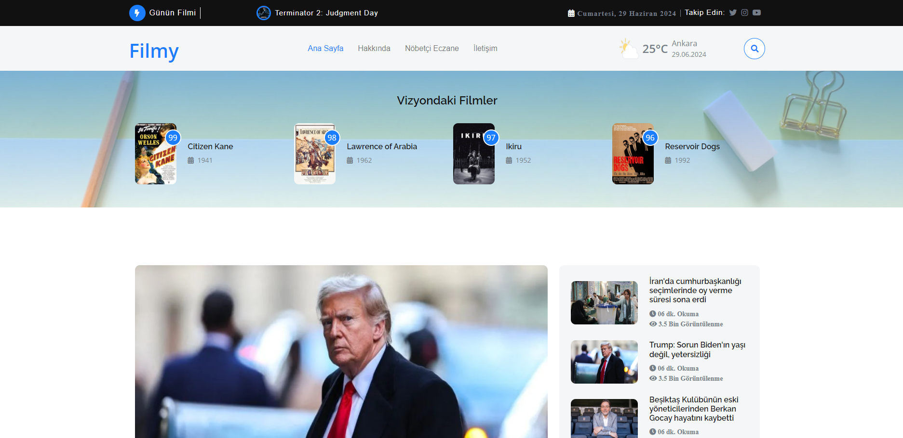
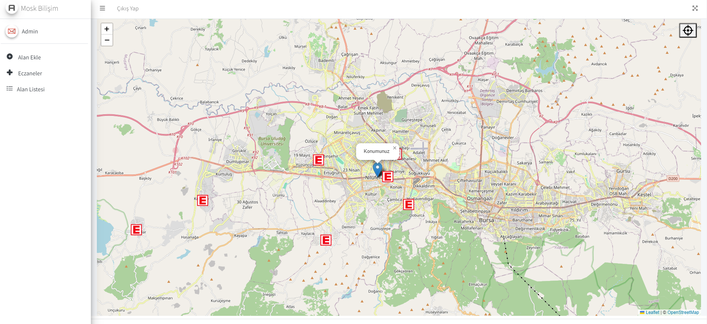
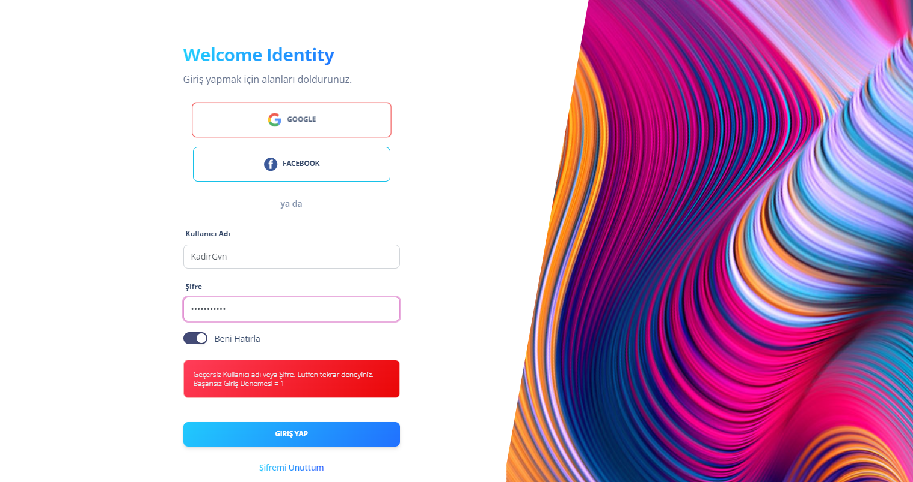
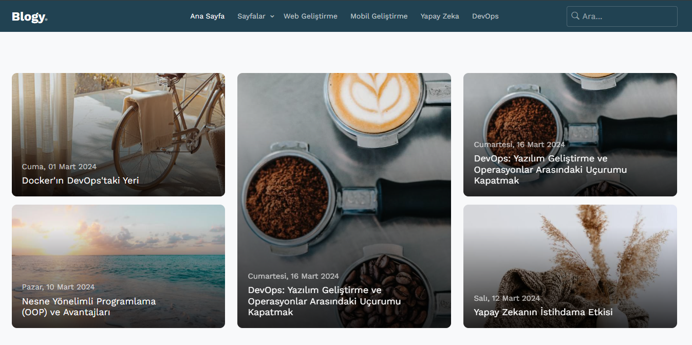

# 💫 About Me:
- 👋 Hi, I’m Kadir.. 
- 👀 I am Full Stack .NET Developer so I'm interested in C#, SQL, NoSQL, ASP.NET. and JavaScript  
- 🌱 I’m currently learning .Net Technology and C#, SQL, NoSQL, ASP.NET Core.. 
- 👀 Whenever I get chance to spend time without .NET, I found myself at iOS Tech and Flutter. 
- 📫 I am greatly interested in mobile applications. 
- 💞️ I’m looking to collaborate on .NET students. 
- 📫 How to reach me kdrgvndeveloper@gmail.com 

## My .NET Products

 

## My iOS App

   

## 🌐 Socials:
    

# 💻 Tech Stack:
                     

### 😂 Random Dev Meme

---

<!-- Proudly created with GPRM ( https://gprm.itsvg.in ) -->
